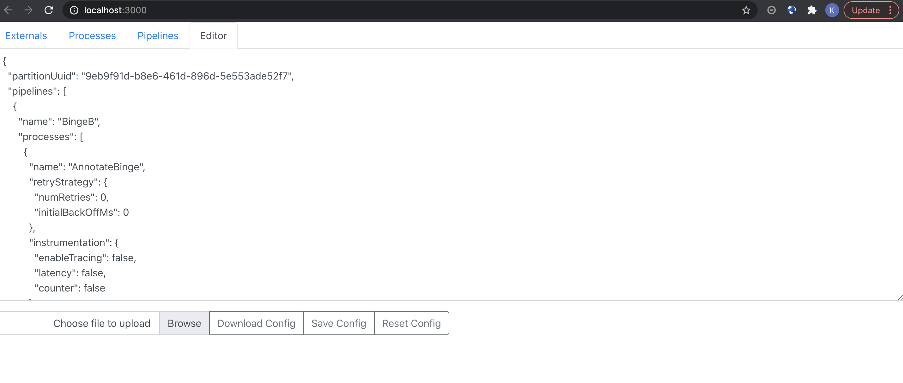

# agglo-config-builder: React-based config builder for Agglo

# Overview

This is a config builder for [Agglo](https://github.com/kmgreen2/agglo).  It will create pipeline configurations to be used with the `binge` event stream processing tool.

To use run: `cd builder/ && npm start`

Navigate to: http://localhost:3000/

Create a Config:

