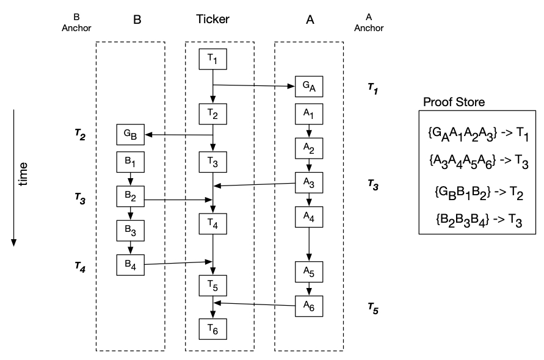
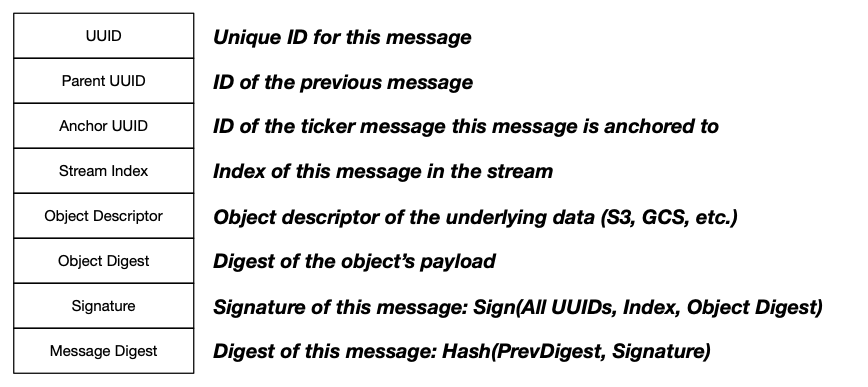

## Entwine: Immutable, Partial Ordering of Events

Entwine is a special process that provides the ability to "entwine" event
timelines.  It is similar to existing blockchain technologies in that it relies
on hash chains for immutability and zero-knowledge proofs for secure
verification of individual event timelines.  There is no consensus mechanism.
The assumption is that each event timeline is generated by an individual,
single organization, binge binary or collection of binge binaries.

An entwined stream of events is a collection of independent substreams that
anchor to a ticker stream.  Currently, the ticker stream is a simple hash chain
that "ticks" at an interval and allows substreams to anchor.  Each anchor
request must contain a signed proof that must be consistent with the ticker's
view of that substream's history.  If verified, the anchor request succeeds.
Today, the ticker process does not have a consensus mechanism, but one can easily be
added by implementing the `Ticker` interface.  For example, one can build a ticker using
traditional consensus algorithms, such as Raft or Paxos, or build a ticker on top of a
distributed ledger, such as Bitcoin or Etherium.

The `HappenedBefore` relation can be applied to all events on an entwined
stream.  This means that we can define a partial ordering of all events in the
stream, where the individual events are independently managed.

A basic example of this could be binge agents deployed to every news outlet in
the world.  Each agent will process every news story from each outlet, where
each outlet will maintain a local ordering in their own private substream.  As
long as each substream anchors to the ticker stream at regular intervals, we
can determine the partial order in which stories are broken and maintain a
sort-of truth index for news outlets (e.g. you cannot change history).

### Entwine in Detail

The figure below shows an example of using entwine on two independent event timelines: A and B.
Each event timeline, called a **substream**, must register with a **ticker** to receive a **genesis proof**.
This genesis proof will be used as the first event in the chain of events periodically anchored to the ticker.
Each substream can anchor its timeline to one or more ticker processes at a specified interval.  Here we have
two substreams anchoring to a single ticker.  Substream A is anchoring every 3 messages, while substream B is
anchoring every 2 messages.

The anchoring protocol requires a substream to provide an immutable chain of events, called a **proof
**, to the ticker.  The first event in the chain must be a genesis proof or the last event from the last
proof anchored by the substream.  This allows the ticker to verify that the events in the proof directly proceed the
last anchored event.  In addition, the verification process will verify the authenticity of each message using a 
signature.  Once a proof is verified, the ticker will reply with a receipt containing the current index of the ticker 
chain and will store a compressed version of the proof in a persistent proof store.

The figure above shows substream A registering and obtaining a genesis proof after T1 and B registers after
T2.  Substream A adds 3 messages to its local chain, then attempts to anchor with the ticker by proving a
proof of the events from the genesis proof (GA) through A3.  The ticker verifies the proof, 
stores a compressed version of the proof along with the corresponding anchor message (T1) and replies with
a receipt containing the latest ticker message, T3.  Substream A will use the latest ticker message to
construct the next proof.  Each substream performs 2 anchors with the ticker, which allows us to define an immutable
partial ordering of events in substreams A and B:

T1 < A1A2A3 < T3 
T2 < B1B2 < T3 
T3 < A3A4A5 < T5 
T3 < B3B4 < T4 

This shows that A1, A2, A3 happened before B3B4 and B1B2 
happened before A3A4A5.

### Entwine Message Format

Here is the entwine message format:

Each message is given a unique UUID, which is used for retrieval and link messages (i.e. parent).  The anchor UUID is
the UUID of the ticker message a given message is anchored to.  The stream index is the monotonically increasing index
of this message in its substream.  The object descriptor is a descriptor that is used by an [Object Store](pkg/storage)
to retrieve the underlying content associated with this message.  The object digest is the digest of the object's
content.  The signature is a signature of the message, signed using a private key configured for the substream.
Finally, the message digest is a hash of the previous message's digest and the signature.

Note that the underlying data is not contained in the message; it is stored in an external object store.  This allows
event timelines to be verified without exposing any of the underlying data.  While the object digest is provided to
the ticker for verification, the object itself can be made inaccessible.  This allows an organization or individual
to participate in the entwine process without exposing any data until they are required to (e.g. audit, court order
, etc.)

### Entwine as a Process

The entwine pipeline process will either use the input JSON map as the payload or will rely on a specified object
descriptor.  If an object descriptor is not specified, it will store the JSON map in the appropriate object store.

The entwine process will do the following:

1. Create a new message and store it in the appropriate immutable substream (backed by a key-value store)
2. Conditionally anchor the substream to a ticker

That's it!

Have a look at the [Entwine Example](../../examples/entwine) for more detail.
